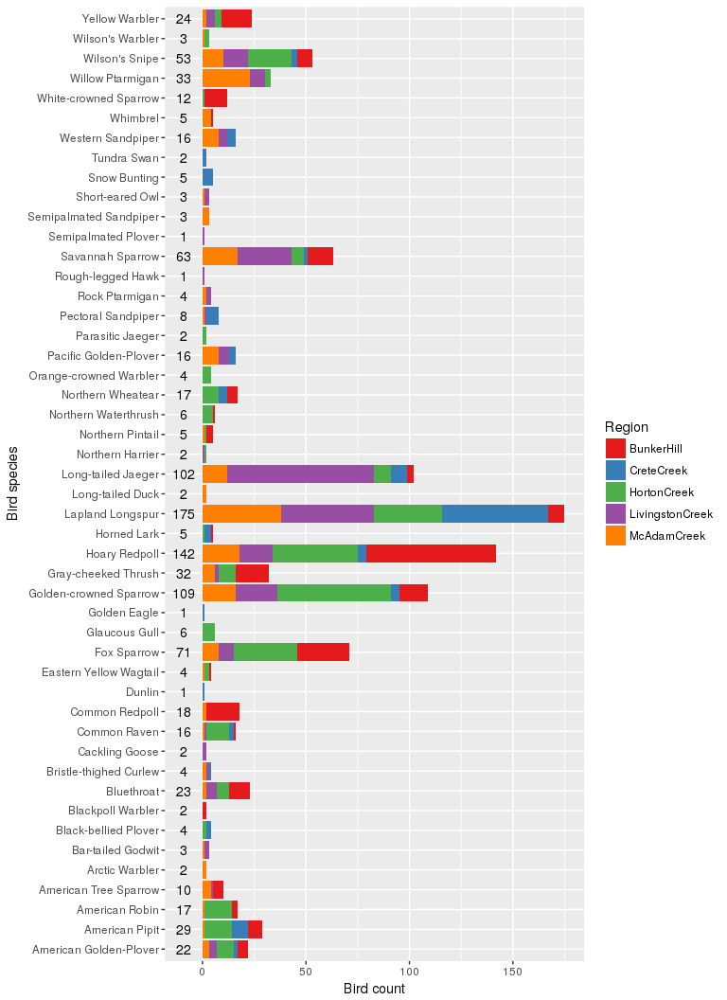

# Avian data: whitepaper
Anton Antonov  
March 24, 2017  


Here's the diagram!

<!-- -->

<!-- Легко заметить, что птицы четырёх видов были наблюдаемы лишь в единственных случаях. Наиболее часто встречающаяся птица -- лапландский подорожник -- была замечена 175 раз. А среди птиц, обитающих в регионе Банкерхилл, больше всего пепельных чечёток. -->

<!-- Изменим порядок уровня фактора Common_name и посмотрим на количество птиц в разных регионах. -->
<!-- ``` {r, fig.width = 8, fig.height = 11} -->
<!-- avian$Common_name <-  factor(avian$Common_name, levels = rev(levels(avian$Common_name))) -->
<!-- ggplot(avian, aes(Site_name)) + -->
<!--   geom_bar(aes(weight = Vis, fill = Common_name)) + -->
<!--   coord_flip() + -->
<!--   labs(y = "Количество птиц", x = "Регион") + -->
<!--   guides(fill=guide_legend(title="Вид птицы", title.position = "top")) + -->
<!--   theme(legend.position = "bottom")+ -->
<!-- geom_text(data = avi_acc2, aes(y = -9, label = sum_b)) -->
<!-- ``` -->

<!-- Рассмотрим связь показателей, характеризующих растительность, с видовым составом птиц. -->
<!-- Обычные корреляционные матрицы демонстрируют связи между каждой парой переменных. Кроме того, функция pairs() не работает на данных большого размера.  -->
<!-- Создадим свою корреляционную матрицу, такую, чтобы выявлять связи между характеристиками растительности, с одной стороны, и количеством наблюдаемых птиц каждого вида, с другой. -->
<!-- ``` {r, fig.width = 8, fig.height = 9} -->
<!-- avian %>%  -->
<!--   gather(Herb, val, 4:17) %>% -->
<!--   group_by(Herb, Common_name) %>% -->
<!--   do(crrl=cor(.$Vis, .$val, use = "complete.obs")[[1]]) %>% -->
<!--   mutate(crrl = unlist(crrl)) %>% -->
<!--   ggplot(aes(Herb, Common_name)) + geom_raster(aes(fill = crrl)) + -->
<!--   xlab("Характеристика растительности") + -->
<!--   ylab("Вид птицы") + -->
<!--   scale_fill_gradient2(name = "Коэффициент\nкорреляции", -->
<!--                        low = "darkred", high = "darkgreen", mid = "white", midpoint = 0)+ -->
<!--   theme(legend.position = "bottom") -->
<!-- ``` -->

<!-- При рассмотрении получившейся диаграммы можно обнаружить, например, что пестрогрудый лесной певун и северная утка обитают в тех местах, гда растёт ольха, белоголовая зонотрихия предпочитает места с более высокими карликовыми берёзами и вереском, а желтая древесная славка и малый дрозд живут в местах, где нет лишайников, но есть ольха. Можно отметить и "безразличие" некоторых птиц, например, дутыша и тундряной куропатки, к исследованным характеристикам растительности. -->
